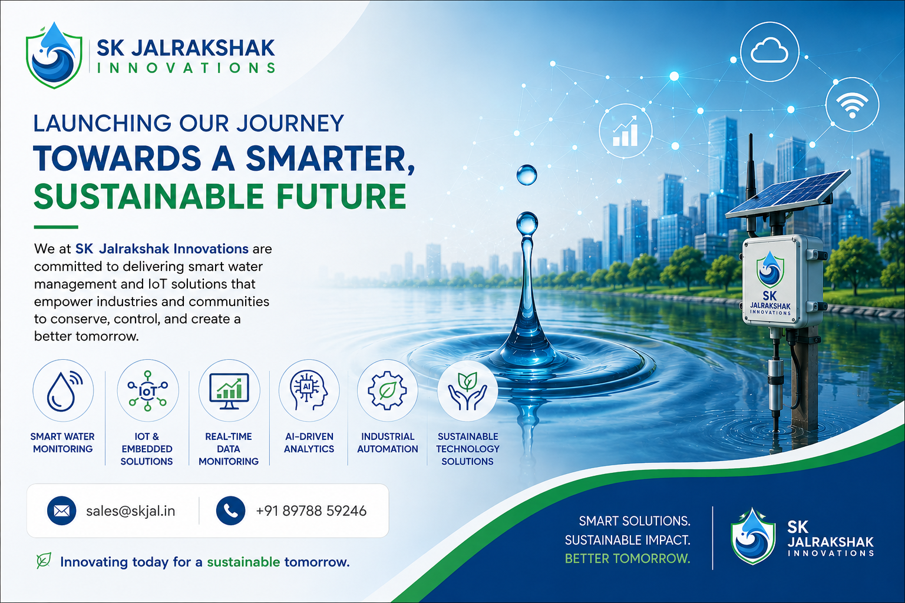

# SK Jalrakshak Innovations Pvt Ltd

An enterprise-grade, high-performance web platform for **SK Jalrakshak Innovations**. We build advanced AI & IoT systems that monitor energy consumption, protect water infrastructure, and ensure human safety in real-time.

## 🚀 Our Core Ecosystem

### 1. Jal Rakshak (Water Intelligence)
Our flagship AI-driven water intelligence platform. Deploying advanced IoT sensors to monitor water quality, detect leaks, and optimize usage in real-time with predictive cloud analytics.

### 2. S.H.I.E.L.D. (Driver Health & Safety)
Smart Health Intelligence for Ergonomic & Live Driving. An AI-powered hardware ecosystem that continuously tracks vibration exposure, speed, and driver health to deliver real-time, personalized safety protocols.

### 3. Energy Meter Monitoring
Offering detailed insights into energy consumption patterns across facilities. By identifying inefficiencies and optimizing usage, organizations can significantly reduce energy costs and enhance sustainability.

---

## 🛠 Tech Stack & Architecture

This platform is engineered for **absolute maximum performance, zero layout shift (CLS), and cinematic UX**. 

- **Frontend:** Vanilla HTML5 & CSS3 (Zero heavy frameworks for instant loading).
- **Motion Engine:** [GSAP 3](https://greensock.com/gsap/) (GreenSock Animation Platform) paired with ScrollTrigger.
- **Smooth Scrolling:** [Lenis](https://lenis.studiofreight.com/) mathematical smooth scroll injected across all pages.
- **3D Rendering:** Three.js for interactive WebGL backgrounds.
- **Routing:** Custom Node.js local routing & Vercel Clean URLs (extensionless paths).
- **Asset Delivery:** Preload headers and high-fetch priority for zero-lag hero images.

---

## 💻 Local Development

To run the platform locally and see your changes instantly:

1. Clone the repository and navigate to the root directory.
2. Ensure you have Node.js installed.
3. Install dependencies (if applicable):
   \`\`\`bash
   npm install
   \`\`\`
4. Boot the custom local development server:
   \`\`\`bash
   npm run dev
   \`\`\`
5. Open your browser to \`http://localhost:5173\`.

> **Note:** If you make changes to the routing logic in \`server.js\`, you must restart the dev server to see the changes.

---

## ☁️ Deployment (Vercel)

This project is perfectly tuned for **Vercel** edge deployment.
- **Clean URLs:** Extensionless routing (\`/shield\` instead of \`/shield.html\`) is strictly enforced via the custom \`vercel.json\` configuration.
- **Asset Optimization:** Vercel automatically compresses and caches the CSS, JS, and SVG assets at the edge.
- **Deployment:** Pushing to the \`main\` branch on GitHub will automatically trigger a production deployment.

\`\`\`bash
git add .
git commit -m "deploy: shipping new updates"
git push
\`\`\`

---

## 📁 Repository Structure

\`\`\`
├── index.html                  # Landing Page
├── jal-rakshak.html           # Product: Water Intelligence
├── shield.html                 # Product: Driver Safety
├── energy-monitoring.html      # Product: Energy Management
├── style.css                   # Global Design System (Typography, Grid, Colors)
├── script.js                   # GSAP Animations & Motion Logic
├── webgl.js                    # Three.js 3D Interactive Backgrounds
├── server.js                   # Custom Local Node.js Server (Port 5173)
├── vercel.json                 # Production Routing & Clean URL Logic
├── favicon.svg                 # Custom SVG Logo & Brand Icon
└── img/                        # High-fidelity Assets & Photography
\`\`\`

---
*© 2026 SK Jalrakshak Innovations Pvt Ltd. All rights reserved.*
